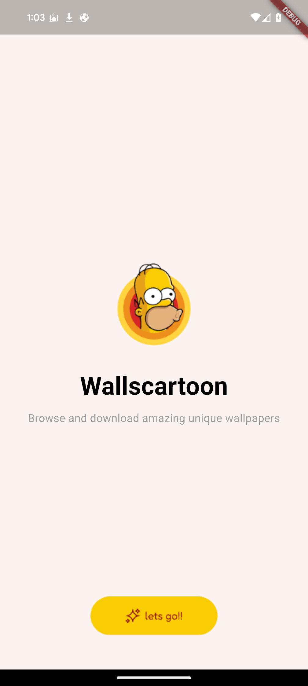
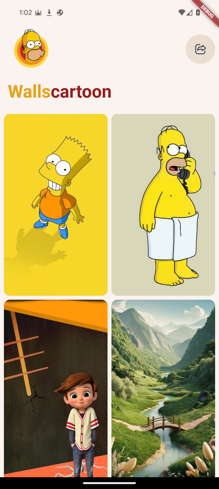
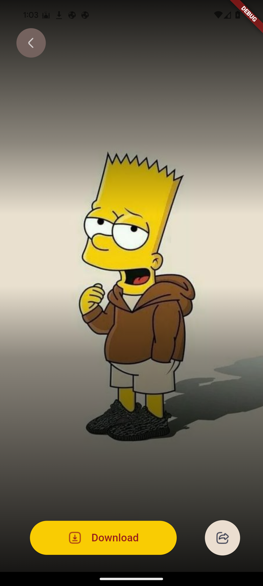
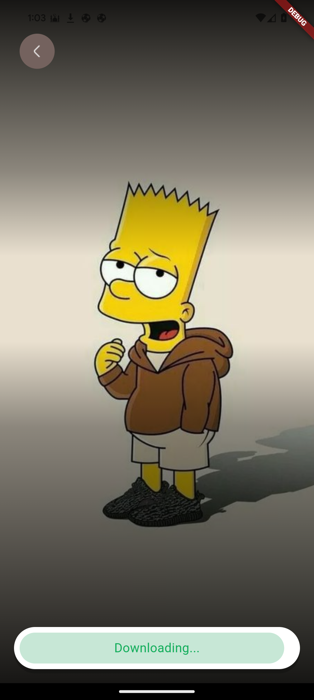

# WallCartoon

WallCartoon is a Flutter application that allows users to discover and download their desired wallpapers effortlessly. With a sleek and user-friendly interface, WallCartoon provides a seamless experience for wallpaper enthusiasts.

## Screenshots

## Screenshots

Here are some screenshots of the WallCartoon app:

|  |  |
|:--:|:--:|
| *Splash Screen* | *Home Screen* |
|  ||
| *Wallpaper Detail view* | *Download Screen* |
## Features

- **User-Friendly Interface**: Simple and intuitive navigation for users to browse wallpapers easily.
- **High-Quality Wallpapers**: Access a wide variety of wallpapers stored in Firebase Cloud Storage.
- **Download Functionality**: Users can easily download their favorite wallpapers to their devices.
- **Firebase Integration**: Utilizes Firebase for cloud storage to fetch and manage wallpaper images efficiently.

## Technologies Used

- **Flutter**: The framework used for building the mobile application.
- **Firebase Cloud Storage**: For storing and retrieving wallpaper images.
- **Dart**: The programming language used for Flutter development.

## Installation

To run WallCartoon locally, follow these steps:

1. **Clone the Repository**:
   ```bash
   git clone https://github.com/yourusername/wallcartoon.git
2. **Navigate to the Project Directory:**:
   ```bash
   cd wallcartoon
3. **Install Dependencies:**:
   ```bash
   flutter pub get
4. **Run the App:**:
   ```bash
   flutter run
   
## Usage
1. Launch the app on your device or emulator.
2. Browse through the categories or use the search feature to find your desired wallpaper.
3. Tap on the wallpaper you like to view it in full screen.
4. Press the download button to save the wallpaper to your device.

## Contributing
Contributions are welcome!

